+++
date = "2026-04-12"
title = "How does HSC2 render overlapping transparent geometry?"

categories = ["code", "math"]

[params]
  math = true
+++


A novel(?) algorithm for stylized order-independent transparency


<!--more-->

_If you're already familiar with techniques for transparent rendering, you can [skip ahead to the algorithms I used in Hyperspeedcube](#hyperspeedcube-1)._

---

A 3D Rubik's cube has 26 pieces[^core] and 54 square stickers. A 4D Rubik's cube has 80 pieces and 216 cubic stickers. That's entirely too many stickers to scan and find the piece you need.

    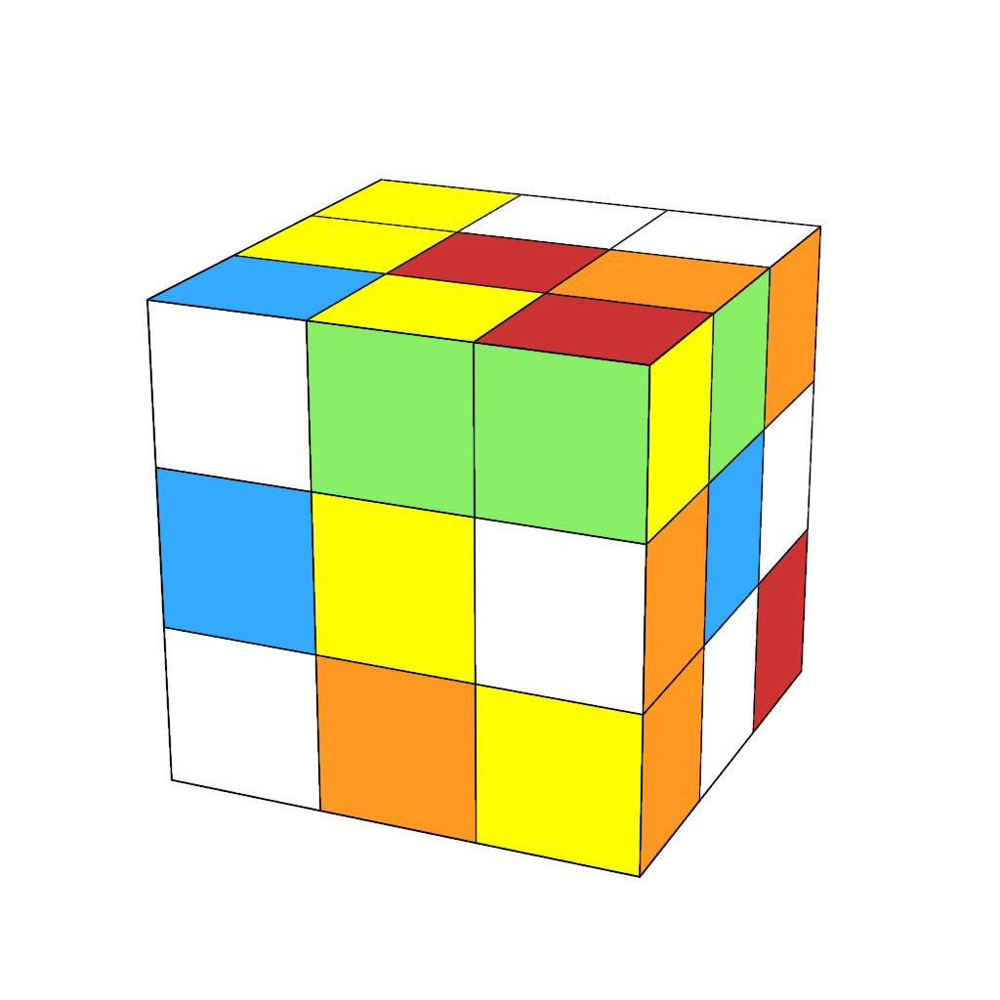
    

        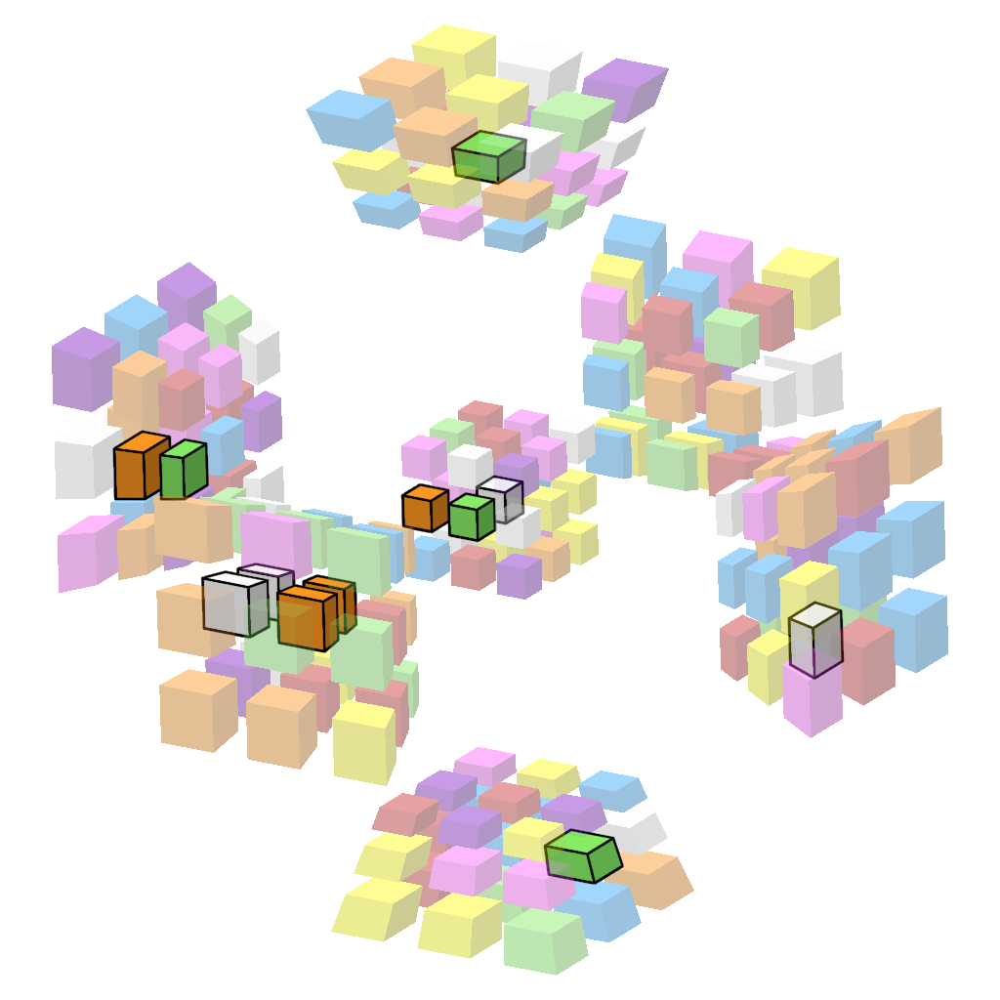
        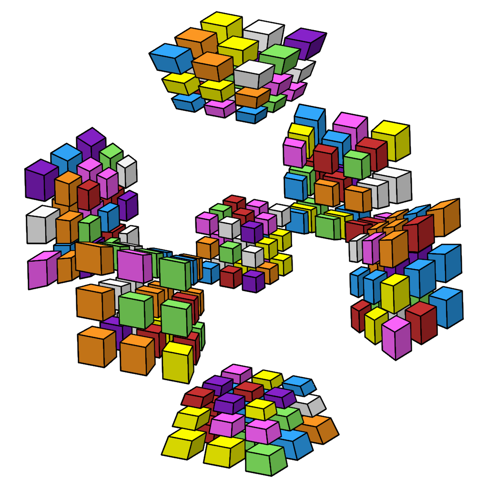
    

Fortunately, we have a solution: piece filters! Tap or hover your mouse on the 4D Rubik's cube above to see. It even works if you <a href="#" onclick="toggleThemeColor();return false;">switch between light and dark mode</a>.

Unfortunately, this requires rendering transparent geometry, which is a [famously difficult problem](https://en.wikipedia.org/wiki/Order-independent_transparency) in realtime rendering. In this post I'll explain why this is hard and how various puzzle programs address it, including [Hyperspeedcube](/projects/hyperspeedcube).

## Basics

First, I'll give a quick refresher on the basic computer graphics pipeline.[^other-techniques] If you're already familiar with 3D graphics, feel free to [skip ahead](#magic-puzzle-ultimate).

### ✨ How to draw a 3D scene ✨

1. Make a list of triangles that cover the surface of each object in the scene.
2. Transform each vertex of each triangle into **screen space**, where X and Y represents coordinates on the screen and Z represents depth (distance from the camera).
3. For each triangle, use the XY coordinates of its points to compute which pixels it contains and paint the color of the triangle in those pixels on the screen.

Typically, step 1 is done once on the CPU, step 2 is done using some matrix math on the GPU, and step 3 is done using specialized hardware on the GPU. Triangles are processed in order, with later ones drawn on top of earlier ones.[^triangle-order]

For our purposes, rendering 4D+ geometry is pretty much the same as rendering 3D geometry. We still turn our objects into 2D triangles and transform them into screen space. World space simply has more dimensions, so our transform is a little trickier and might include multiple layers of [perspective projection](https://en.wikipedia.org/wiki/Perspective_(graphical)). For the purposes of this post, we can just think about 3D geometry.

### Z-buffer

This algorithm requires our triangles to be sorted from farthest to closest to ensure that objects close to the camera are painted on top of ones farther away. But sorting a lot of triangles is really slow, and we have to sort them again every time we move the camera!

Luckily, there's a trick to avoid needing to sort our triangles: we can use a **Z-buffer**, which is essentially an extra grayscale texture (image) where the brightness of each pixel indicates the distance from the screen, the Z coordinate of the point. Here's an example of a 3D scene and its Z-buffer, where darker regions are closer to the camera and lighter regions are farther away:



Before drawing each pixel, we check the old Z coordinate in the Z-buffer against the Z coordinate of the new pixel to see whether the new pixel should be in front of the old one (in which case we paint the new pixel as usual, and update the Z-buffer) or behind the old one (in which case we discard the new pixel). This is called the **depth test**.

Because the Z-buffer tests each pixel individually, it works well for intersecting geometry. This is especially important for 5D+ geometry, which results in a lot of intersections when projected down to 3D.

### Blending

Suppose we want to draw a transparent triangle in the foreground on top of some other geometry in the background. Instead of completely replacing background color, we can blend it with the foreground color. If the triangle in the foreground is 30% opaque (70% transparent), then we mix 30% of the foreground color $f$ with 70% of the background color $b$:

$$
0.3 f + 0.7 b
$$

In general, where $\alpha$ is the opacity:

$$
\alpha f + (1-\alpha) b
$$

This ... mostly works? Let's see what happens.

## Magic Puzzle Ultimate

[Magic Puzzle Ultimate](https://superliminal.com/andrey/mpu/) by [Andrey Astrelin](https://superliminal.com/andrey/) was, I believe, the first puzzle simulator to support arbitrary shapes in higher dimensions. It also includes piece filters!

<video src="mpu.mp4" autoplay="true" loop="true" width="50%"></video>

Try to look past the weird flickering lighting, and instead look at the weird transparency. (In case it isn't clear: the dark stickers are supposed to be transparent.) In particular, notice how sometimes opaque stickers are visible behind transparent ones, as they should be, but sometimes the opaque geometry is completely obscured.

Consider the case where a transparent triangle is in front of an opaque one. There's two possibilities:

1. The opaque triangle is drawn first and its Z coordinate is saved to the Z-buffer. The transparent triangle _passes_ the depth test (because is it in _front_ of the opaque triangle) and is drawn on top using blending. This looks good.
2. The transparent triangle is drawn first and its Z coordinate is saved to the Z-buffer. The opaque triangle _fails_ the depth test (because it is _behind_ the transparent triangle) so it is not drawn.

Because the triangles aren't sorted, it's entirely random which of these will happen. The whole point of making things transparent is so that you can see through them, so this needs some work.

### Can we fix it?

There's an easy improvement we can make to the technique used by Magic Puzzle Ultimate:

1. Draw all opaque triangles first.
2. Draw transparent triangles, reading the Z-buffer for depth testing, but not writing to the Z-buffer.

This is the standard way to handle transparency in 3D rendering. It ensures that opaque geometry is never completely blocked by transparent geometry, but it has a subtle problem. Consider this scene with red and blue transparent sheets in front of white cubes:



The transparent sheets all have the same opacity, but the color of the sheet in front is weighted much more heavily in the color mix than the sheet behind. If we don't sort our transparent triangles from farthest to nearest, the one in back might be drawn later and therefore it'll be weighted more heavily.

If we want to stick with the simple blending formula, then the only option is to sort our triangles.

## Hyperspeedcube 1

Well, we don't have to sort individual triangles. In Hyperspeedcube 1, I just sort the stickers on the CPU and use that to determine the order of the triangles.[^gpu-sorting] Since triangles are drawn from back to front, we don't need even need a Z-buffer. The result looks quite nice!

    

        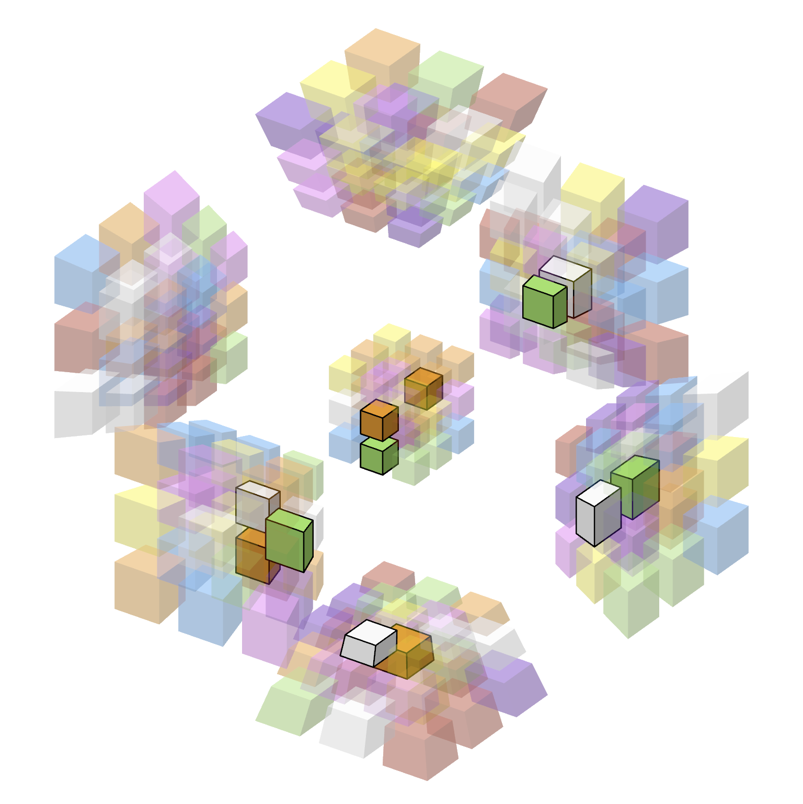
        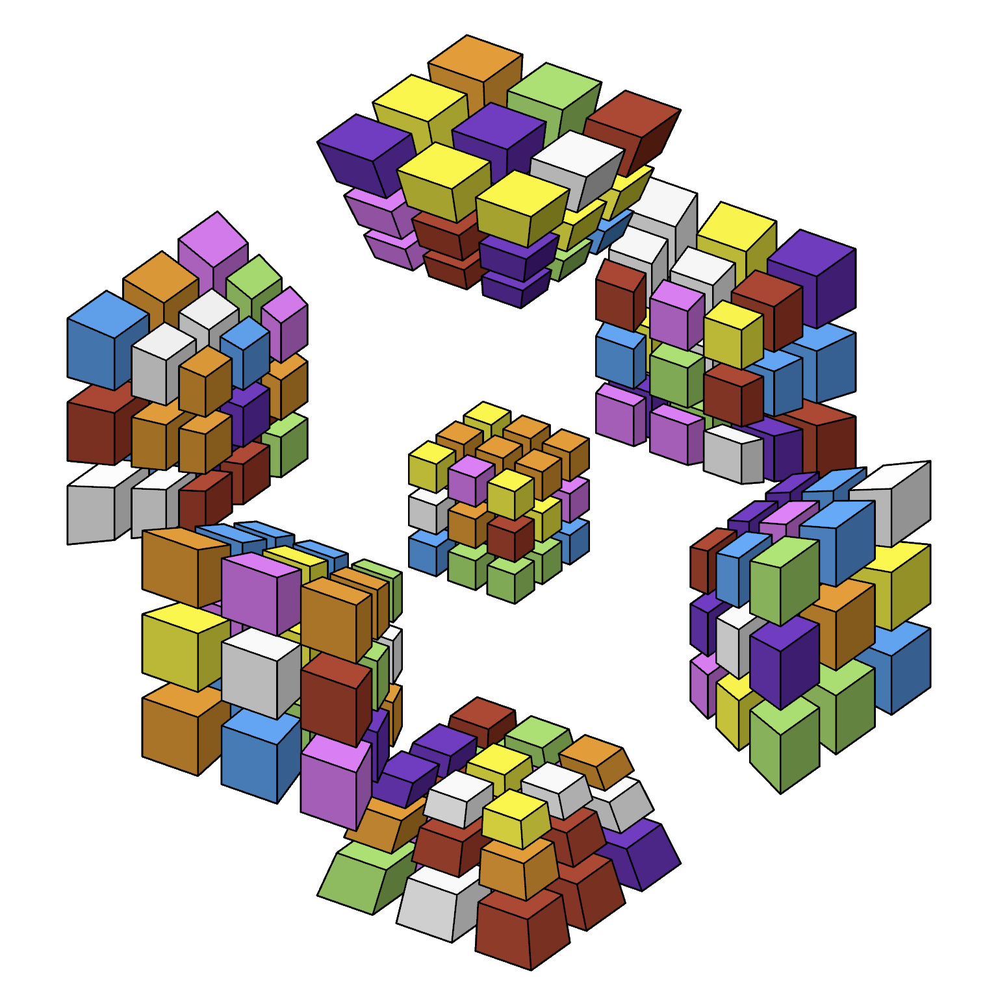
    

Tap or hover your mouse on the image to see the puzzle without filters. It even works if you <a href="#" onclick="toggleThemeColor();return false;">switch between light and dark mode</a>.

At the time, I was quite happy with this! But I later found three issues with it.

### Problem 1: Fog

Multiple layers of transparent stickers combine into a fog that obscures the stickers behind. This isn't an issue on a 3x3x3x3, but on a larger puzzle like 9x9x9x9 it becomes quite difficult to see inner layers:

    

        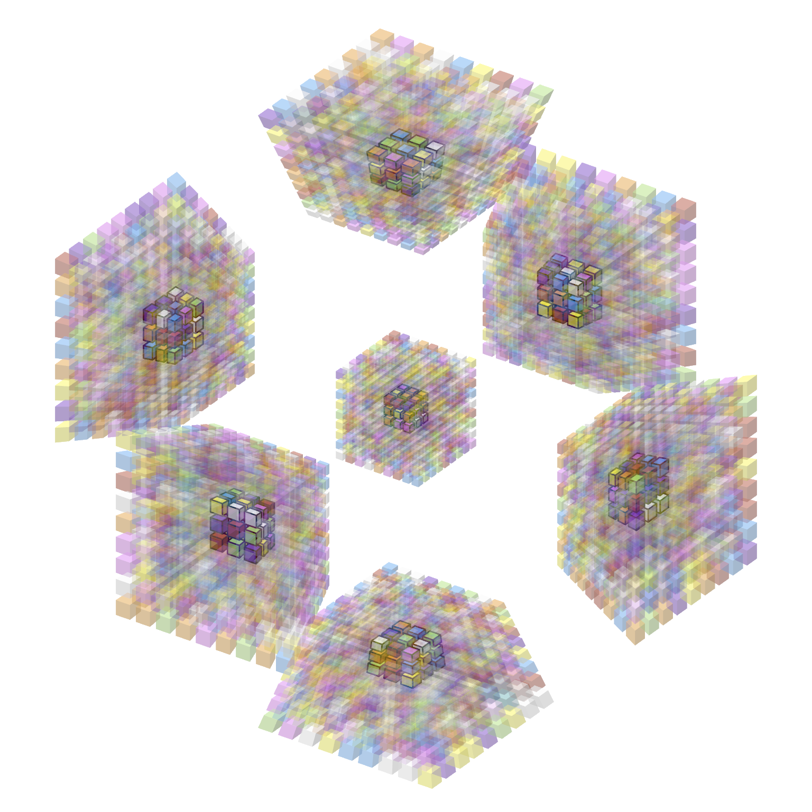
        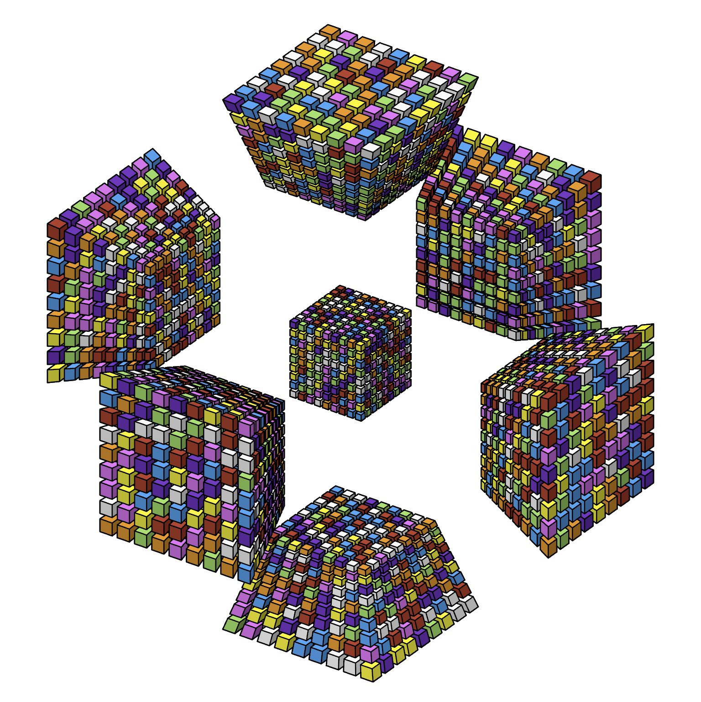
    

Of course you could compensate by lowering the opacity of stickers, but you'd have to raise it again later when solving the outer layers. Besides, the fog makes it difficult to tell the color of the transparent stickers too; only the colors near the edges of each cell are legible.

### Problem 2: Performance

Sorting stickers must happen on the CPU, which means the transformation from world space to screen space must also happen on the CPU instead of the GPU. Combined, these amount to expensive computations on the CPU that lower the framerate on large puzzles.

### Problem 3: Intersections

<video src="hsc1_popping.mp4" autoplay="true" loop="true" width="50%" defaultPlaybackRate="0.25"></video>

Sorting stickers doesn't work when stickers intersect each other because neither one is always in front of the other. In practice, this leads to "popping" where one sticker will suddenly appear from behind another one. You have to really mess with the projection to make this happen for a 4D Rubik's cube, but it would happen on 5D puzzles in Hyperspeedcube 2.

It's possible to solve this by splitting triangles using [Newell's algorithm](https://en.wikipedia.org/wiki/Newell%27s_algorithm), which [I implemented in a test project](https://github.com/HactarCE/newell-rs), but that would be significantly slower than simply sorting the stickers. 3D projections of high-dimensional cubes have _exponentially many intersections_ between triangles, which would be catastrophic for performance.

## Hyperspeedcube 2

Let's take a step back. What are we actually trying to model here?

### Photorealism is bad, actually

A projected sticker of a 4D Rubik's cube is a ([perspective-distorted](https://en.wikipedia.org/wiki/Perspective_distortion)) cube. If the sticker is truly made of some transparent material, then where is the color coming from?

- Is the sticker made of some uniform semi-transparent material, like stained glass? If so, the thickness of the sticker should affect its opacity.
- Is the sticker 100% transparent, but its surface coated with some semi-transparent film? If so, then we should be able to see the back of each sticker as well.

Neither of these is what we've been doing, and neither of them is really what we want. If photorealism is not the goal, then what is?

### Simple algorithm

The purpose of hiding pieces is to reveal and/or emphasize other ones. There are two reasons to keep stickers transparent instead of invisible:

- Ensure big blocks of pieces that were previously solved have not been scrambled.
- Give positional context for opaque pieces.

Neither of these requires transparent pieces to be visible behind other transparent pieces. Here's what I came up with:

1. Render all opaque geometry to one texture.
2. Render all opaque _and_ transparent geometry to another texture (as though they were fully opaque).
3. Blend the textures together with some ratio determining how opaque the geometry should be.

This approach solves all of our problems!

- No sorting, so it's fast (although it does requires three render passes).
- Uses traditional Z-buffering, so it works for intersecting geometry.
- Only one transparent piece is visible at each pixel, so there's no fog.

The first texture is responsible for the opaque geometry visible behind the transparent geometry, and the second texture is responsible for the transparent geometry in front. When both textures show the same object at a pixel, it is because an opaque object is in front.

Here's the same 9x9x9x9 demo as before but rendered using this technique in Hyperspeedcube 2:

    

        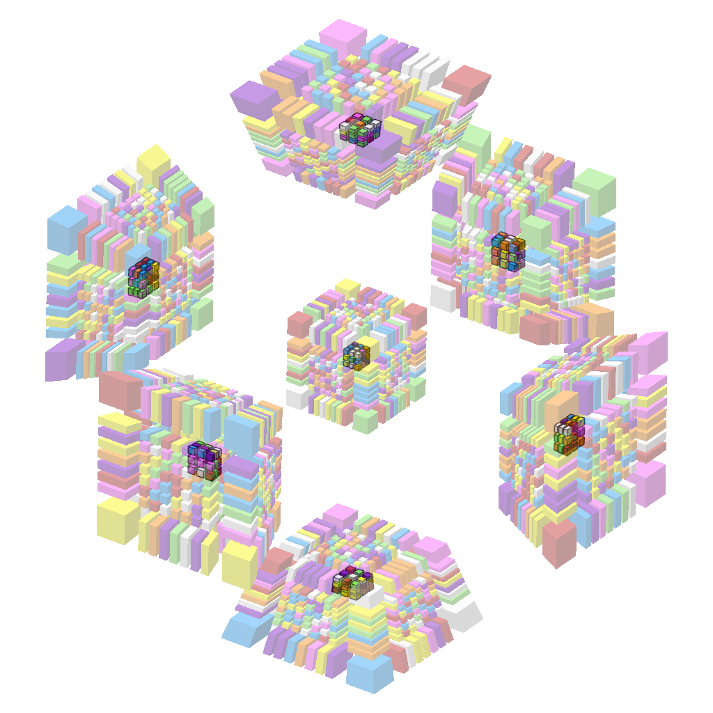
        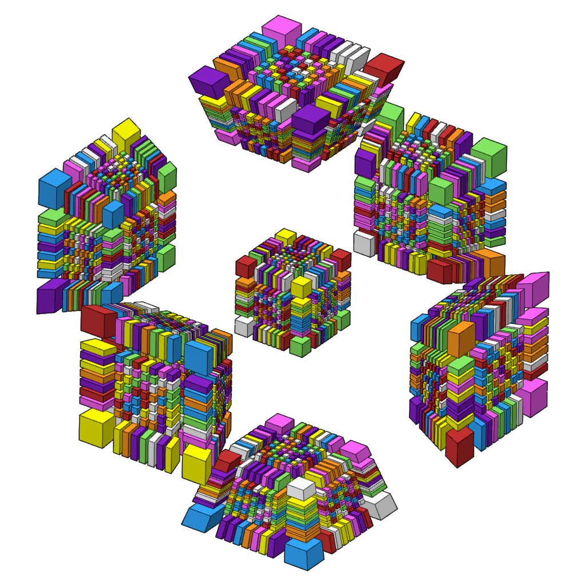
    

(The outer layers being thicker is a stylistic choice unrelated to the rendering technique.)

### Generalized algorithm

We can generalize this to work with objects with different opacities. We still only need two textures, which I'll call the accumulator and the output, both initialized to black. In general, if your geometry is separated into groups $G_1, \dots, G_n$ at opacities $\alpha_1, \dots, \alpha_n$ (where the groups are sorted in order of decreasing opacity), the algorithm is as follows:

1. Fill accumulator and output with zero.
2. For $i \in [1,n]$:
    1. Render $G_i$ to accumulator with full opacity.
    2. Add $(\alpha_{i} - \alpha_{i+1})\cdot{}$accumulator into output.

We set $\alpha_{n+1} = 0$ to avoid a special case on the last iteration. Note that when we render geometry to the accumulator, it overwrites the existing pixels only when the new geometry is in front of the old geometry (determined using the accumulator's Z-buffer).

Some technical notes for anyone looking to implement this:

- The accumulator needs a Z-buffer, but no alpha channel.
- The output needs no Z-buffer, and an alpha channel is only necessary if the end result should have an alpha channel (like the images I generated for this post).
- As I've described it, the output has premultiplied alpha but the algorithm could be modified to keep it non-premultiplied.

Let's run through an example. Suppose we have 3 opacity levels: $\alpha_1 = 1$, $\alpha_2 = 0.45$, and $\alpha_3 = 0.2$.

We'll use two textures, which I'll call the accumulator and the output.

1. Fill accumulator and output with zero.
2. Render $G_1$ to accumulator with full opacity.
3. Copy accumulator to output at 55% opacity.
4. Render $G_2$ to accumulator with full opacity.
5. Copy accumulator to output at 25% opacity.
6. Render $G_3$ to accumulator with full opacity.
7. Copy accumulator to output at 20% opacity.

The idea here is that an object $A$ is only visible behind an object $B$ when $A$ is more opaque than $B$, and amount by which it is more opaque determines how visible it is. This gets effectively the same result as [dithering/screen-door transparency](https://digitalrune.github.io/DigitalRune-Documentation/html/fa431d48-b457-4c70-a590-d44b0840ab1e.htm), but without the visible pixel pattern. I actually considered using screen-door transparency in HSC2, but its transparency gradations are relatively coarse and it adds noise to an otherwise already-quite-noisy image. (It's not uncommon to use 2% opacity.) I want HSC2 to be a strict upgrade over HSC1 so that no one has a reason to keep using HSC1.

The tradeoff is that two render passes are required for each unique transparency level. This isn't much of an issue for Hyperspeedcube, since in practice there will rarely be more than a handful of transparency levels. If it's ever an issue, I can add an option to use screen-door transparency instead, or even a hybrid approach between the two.

We can even recreate the fog effect using multiple layers of transparency if we really want, although it's imperfect because we can only make a distinct transparency level for pieces based on their layer in the puzzle.

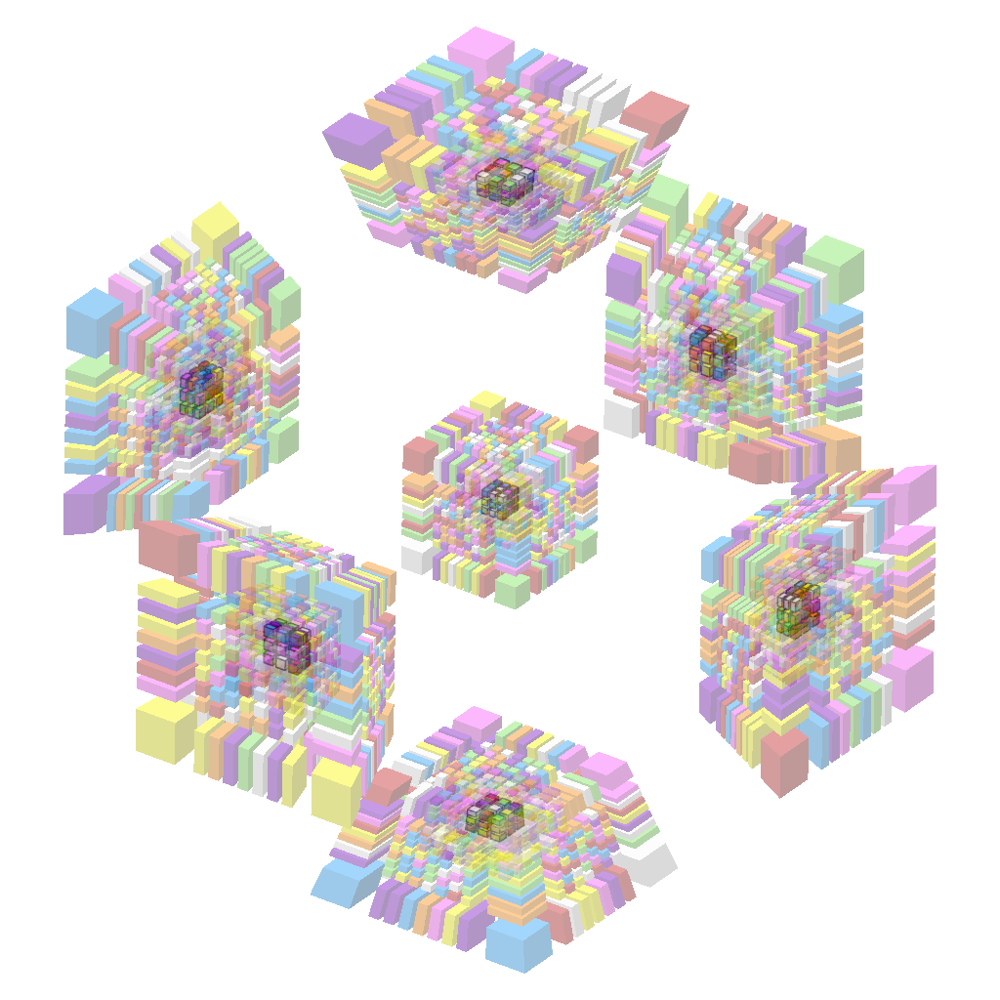

I think this technique strikes a good balance of aesthetics, usability, and performance, and it was relatively easy to implement.

## Addendum: Outlines and grayscaling

Transparency is only part of the equation. Hyperspeedcube provides use other techniques that can be used on their own or in conjunction with transparency to deemphasize pieces. For example, when I'm solving a duoprism, I use three filter levels:

- The pieces I'm currently solving are fully-opaque and outlined.
- The pieces I've already solved are partially transparent and have no outlines.
- All other pieces are more transparent and grayed out. I keep them visible to give positional context for the pieces I'm solving.

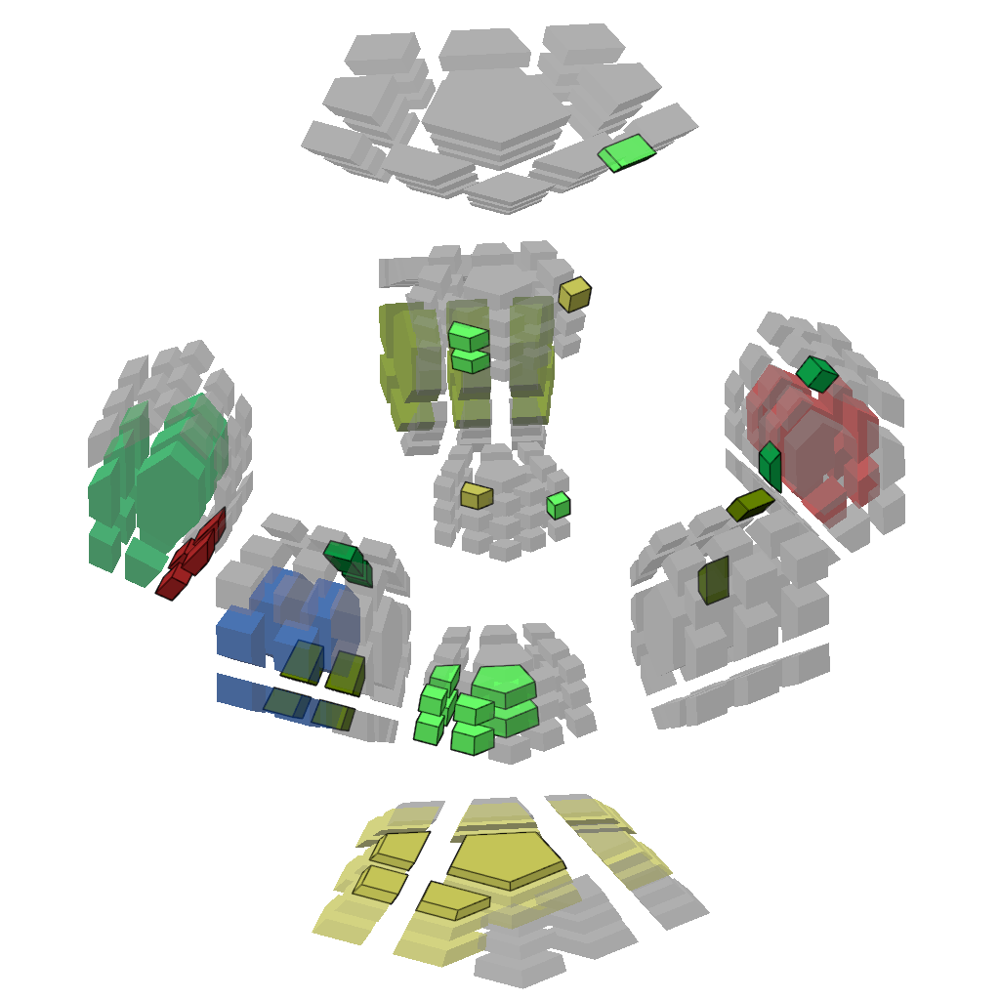

---

## Licensing

All images in this post, except where stated otherwise, are created by me and are hereby released under [CC BY-SA 4.0](https://creativecommons.org/licenses/by-sa/4.0/)

[^core]: Including centers, but excluding the core.
[^other-techniques]: In this post, I only describe [rasterization](https://en.wikipedia.org/wiki/Rasterisation). There are other techniques, notably [ray marching](https://en.wikipedia.org/wiki/Ray_marching) (which is [great for fractals](https://www.youtube.com/watch?v=svLzmFuSBhk)!) and [ray tracing](https://en.wikipedia.org/wiki/Ray_tracing_(graphics)) but I'm skeptical of their use for realtime 4D+ rendering. In particular, raymarching with 4D geometry [is possible](https://syntopia.github.io/Polytopia/polytopes.html), although much more difficult and less performant than with 3D geometry.
[^triangle-order]: Ok so actually I lied. GPUs run thousands of triangles in parallel but the result is guaranteed to be indistinguishable from the triangles being drawn in order, one at a time.
[^gpu-sorting]: Implementing a GPU sorting algorithm is [possible but annoying](https://arxiv.org/pdf/1709.02520).
